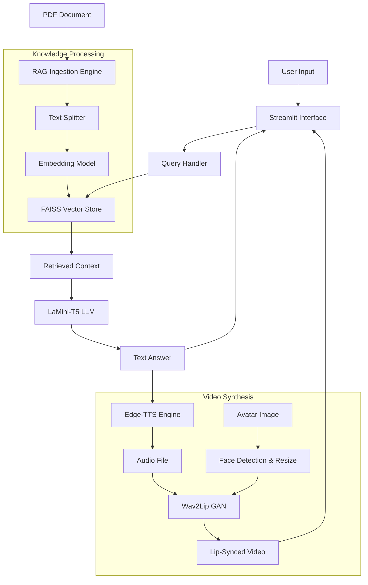

# System Architecture

## Overview
**Knowledge To Life** is an offline, privacy-first AI application that transforms static documents into interactive, audiovisual experiences. It combines Retrieval-Augmented Generation (RAG) with generative video AI to create a digital avatar that answers questions based on uploaded content.

## High-Level Data Flow

## Core Components

### 1. RAG Engine (`src/rag_engine.py`)
*   **Purpose**: Semantic search and answer generation.
*   **Models**: 
    *   Embeddings: `all-MiniLM-L6-v2` (Fast, efficient)
    *   LLM: `LaMini-T5-738M` (Offline, CPU-friendly)
*   **Storage**: FAISS (Local vector database).

### 2. Video Generator (`src/video_generator.py`)
*   **Purpose**: Creates the talking avatar.
*   **Core Model**: `Wav2Lip` (Generative Adversarial Network).
*   **Optimization**: 
    *   Input avatars are resized to `256x256`.
    *   Inference runs in a simplified, single-thread mode to prevent CPU saturation.

### 3. TTS Engine (`src/tts_generator.py`)
*   **Purpose**: Converts text to speech.
*   **Technology**: Microsoft Edge TTS (Neural quality, free usage).

## Technical Constraints & Design Decisions
*   **Offline First**: All models run locally. No data leaves the machine (except for TTS API calls).
*   **CPU Optimization**: Video generation is computationally expensive. The system uses a batch-processing model (Generate -> Play) rather than real-time streaming to ensure high quality and stability on consumer hardware.
